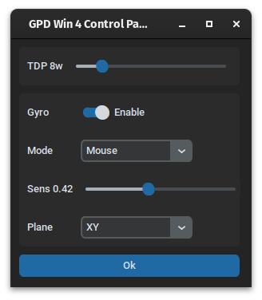

# GPD Win4 Control Panel
Simple TDP/gyro manager for GPD Win4 written with customtkinter.



## Requirements
1. [customtkinter](https://github.com/TomSchimansky/CustomTkinter)
2. [BMI260 userspace driver](https://github.com/architector1324/bmi260-driver)
3. [Ryzen TDP manager](https://github.com/architector1324/ryzen-tdp)

## Install
1. Clone this repository.
```bash
git clone https://github.com/architector1324/gpdwin4cp
```

2. Install customtkinter:
```bash
pip install customtkinter
```

3. Clone and install extra services, follow the instructions in there repos:
```bash
git clone https://github.com/architector1324/bmi260-driver
git clone https://github.com/architector1324/ryzen-tdp
```
